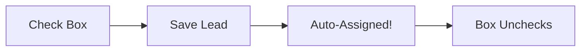
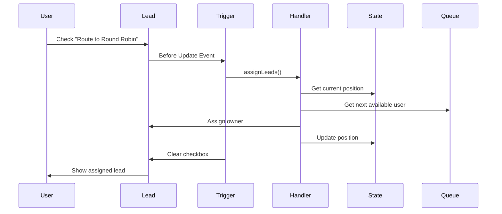

# 🎯 Salesforce Lead Round Robin Assignment

> **A production-ready solution for distributing leads equally across multiple sales queues with intelligent user rotation**


## 📋 Table of Contents
- [The Problem](#-the-problem-this-solves)
- [The Solution](#-the-solution)
- [How It Works](#-how-it-works)
- [Installation Guide](#-installation-guide)
- [Configuration](#-configuration)
- [Architecture](#-architecture-overview)
- [Components Reference](#-components-reference)
- [Usage Examples](#-usage-examples)
- [Troubleshooting](#-troubleshooting)
- [Best Practices](#-best-practices)
- [FAQ](#-frequently-asked-questions)

## 🎯 The Problem This Solves

### The Challenge
Many sales organizations struggle with fair lead distribution:
- **Manual Assignment**: Managers spending hours distributing leads
- **Unequal Distribution**: Some reps get more leads than others
- **Queue Imbalance**: Multiple queues with different team sizes
- **No Audit Trail**: Can't track who assigned what and when

### Real-World Scenario
Imagine you have:
- **Queue 1**: "Enterprise Sales" with 10 team members
- **Queue 2**: "SMB Sales" with 20 team members
- **1000 new leads** coming in daily

❌ **Without Round Robin**: Leads pile up, manual distribution takes hours, some reps get 100 leads while others get 20.

✅ **With Round Robin**: Leads are automatically distributed equally - Queue 1 gets 500, Queue 2 gets 500, each rep gets their fair share.

## 💡 The Solution

This package provides **checkbox-triggered round robin assignment** that:
- ✅ Distributes leads **equally between queues** (not by user count)
- ✅ Maintains **fair rotation within each queue**
- ✅ Handles **10,000+ bulk operations**
- ✅ Provides **complete audit trail**
- ✅ Shows **clear error messages** for easy troubleshooting
- ✅ **Skips empty queues** automatically

### Assignment Pattern
```
Lead 1 → Queue1-User1
Lead 2 → Queue2-User1
Lead 3 → Queue1-User2
Lead 4 → Queue2-User2
... continues alternating
```

## 🔄 How It Works

### Simple 3-Step Process



1. **User Action**: Check "Route to Round Robin" checkbox on any lead
2. **System Process**: Finds next queue/user in rotation
3. **Result**: Lead assigned, checkbox cleared, audit trail updated

### Visual Flow
```
┌─────────────┐     ┌─────────────┐     ┌─────────────┐
│   New Lead  │────▶│  Check Box  │────▶│  Assigned!  │
│ (Unassigned)│     │ ✓ Route to  │     │ Owner: John │
│             │     │ Round Robin │     │ Queue: SMB  │
└─────────────┘     └─────────────┘     └─────────────┘
```

## 📦 Installation Guide

### Prerequisites
- Salesforce org (any edition with API access)
- System Administrator profile
- Basic understanding of Salesforce Setup menu

### Step-by-Step Installation

#### 1️⃣ **Deploy the Package**

**Option A: Deploy to Salesforce Button** (Easiest)
```
Coming soon - Use manual deployment for now
```

**Option B: Salesforce CLI**
```bash
# Clone the repository
git clone https://github.com/yourusername/salesforce-lead-round-robin.git
cd salesforce-lead-round-robin

# Deploy to your org
sfdx force:source:deploy -p force-app
```

**Option C: Manual Deployment**
1. Download the repository as ZIP
2. Use Workbench or VS Code to deploy

#### 2️⃣ **Create Your Queues**

1. Go to **Setup** → **Queues**
2. Click **New**
3. Configure your queue:

| Field | Value | Example |
|-------|-------|---------|
| Label | Your queue name | "Enterprise Sales Team" |
| Queue Name | Auto-generated | "Enterprise_Sales_Team" |
| Queue Email | Optional | "enterprise@company.com" |
| Object: Lead | ✅ Check this | Required |
| Queue Members | Add users | John, Jane, Bob |

4. Click **Save**
5. **IMPORTANT**: Copy the Queue ID from the URL: `00G...`

#### 3️⃣ **Configure Round Robin Queues**

1. Go to **Setup** → **Custom Metadata Types**
2. Find **"Round Robin Queue Config"**
3. Click **"Manage Records"**
4. Click **"New"** to add your queue:

| Field | Description | Example Value |
|-------|-------------|---------------|
| Label | Friendly name | "Enterprise Queue Config" |
| Name | Auto-generated | "Enterprise_Queue_Config" |
| Queue ID | Paste from Step 2 | "00G5f000004CSVIEA4" |
| Queue Developer Name | For reporting | "Enterprise_Sales" |
| Is Active | Enable queue | ✅ Checked |
| Sort Order | Processing order | 1 |

5. Repeat for each queue

#### 4️⃣ **Add Fields to Page Layout**

1. Go to **Setup** → **Object Manager** → **Lead**
2. Click **Page Layouts**
3. Edit your layout
4. Add these fields:

**User-Facing Fields:**
| Field | Section | Required | Description |
|-------|---------|----------|-------------|
| Route to Round Robin | Lead Information | Yes | Checkbox users check |
| Last Round Robin Error | Round Robin Status | No | Shows any errors |

**Admin Fields (optional):**
| Field | Section | Read-Only | Description |
|-------|---------|-----------|-------------|
| Round Robin Assignment DateTime | Round Robin Status | Yes | When assigned |
| Round Robin Queue | Round Robin Status | Yes | Which queue assigned from |
| Round Robin Triggered By | Round Robin Status | Yes | Who triggered it |

5. Click **Save**

#### 5️⃣ **Set Field Permissions**

1. Go to **Setup** → **Profiles** (or Permission Sets)
2. For each profile that needs round robin:

| Field | Read | Edit |
|-------|------|------|
| Route to Round Robin | ✅ | ✅ |
| All other RR fields | ✅ | ❌ |

## ⚙️ Configuration

### Custom Metadata Configuration

The system uses **Custom Metadata** for deployable, version-controlled configuration:

| Setting | Purpose | Example |
|---------|---------|---------|
| Multiple Queues | Support unlimited queues | Queue1, Queue2, Queue3... |
| Sort Order | Control assignment sequence | 1, 2, 3... |
| Active Flag | Enable/disable queues | Active ✅ / Inactive ❌ |

### State Management

The system maintains state in a custom object:

| Object | Purpose | Key Fields |
|--------|---------|------------|
| Round Robin Assignment State | Tracks rotation position | Current Queue Index, Queue User Indices (JSON) |

## 🏗️ Architecture Overview

### Component Architecture

```
┌──────────────────────────────────────────────────────────┐
│                    Lead Round Robin System                │
├──────────────────────────────────────────────────────────┤
│                                                           │
│  ┌─────────────┐    ┌──────────────┐    ┌────────────┐ │
│  │   Trigger   │───▶│   Handler    │───▶│   State    │ │
│  │  (Before/   │    │   Class      │    │   Record   │ │
│  │   After)    │    │              │    │            │ │
│  └─────────────┘    └──────────────┘    └────────────┘ │
│         │                   │                    │        │
│         ▼                   ▼                    ▼        │
│  ┌─────────────┐    ┌──────────────┐    ┌────────────┐ │
│  │Lead Fields  │    │   Metadata   │    │   JSON     │ │
│  │ (Checkbox)  │    │   (Queues)   │    │  Storage   │ │
│  └─────────────┘    └──────────────┘    └────────────┘ │
│                                                           │
└──────────────────────────────────────────────────────────┘
```

### Data Flow



## 📚 Components Reference

### Apex Classes

| Class | Purpose | Key Methods |
|-------|---------|-------------|
| `RoundRobinAssignmentHandler` | Main logic | `assignLeads()`, `validateSecurityPermissions()` |
| `RoundRobinAssignmentHandlerTest` | Test coverage | 90%+ coverage required |
| `RoundRobinTestHelper` | Test utilities | Mock data creation |

### Custom Objects

#### Lead Fields
| Field API Name | Type | Purpose | User Editable |
|----------------|------|---------|---------------|
| `Route_to_Round_Robin__c` | Checkbox | Triggers assignment | ✅ Yes |
| `Round_Robin_Processing__c` | Checkbox | Prevents recursion | ❌ No (Hidden) |
| `Assigned_Through_Round_Robin__c` | Checkbox | Tracking flag | ❌ No |
| `Round_Robin_Assignment_DateTime__c` | DateTime | When assigned | ❌ No |
| `Round_Robin_Queue__c` | Text | Source queue | ❌ No |
| `Round_Robin_Triggered_By__c` | Lookup(User) | Who triggered | ❌ No |
| `Round_Robin_Source__c` | Text | Manual/Data Loader/API | ❌ No |
| `Last_Round_Robin_Error__c` | Text | Error messages | ❌ No |
| `Last_Round_Robin_Attempt__c` | DateTime | Last attempt | ❌ No |

#### Round Robin Assignment State
| Field | Type | Purpose |
|-------|------|---------|
| `Current_Queue_Index__c` | Number | Position in queue rotation |
| `Queue_User_Indices__c` | Long Text | JSON map of user positions per queue |
| `Total_Assignments__c` | Number | Lifetime assignment count |
| `Last_Assignment_DateTime__c` | DateTime | Last successful assignment |
| `Last_Assigned_User__c` | Lookup(User) | Last user who received a lead |

### Custom Metadata Type

#### Round_Robin_Queue_Config__mdt
| Field | Type | Required | Example |
|-------|------|----------|---------|
| `Queue_ID__c` | Text(18) | ✅ | "00G5f000004CSVIEA4" |
| `Queue_Developer_Name__c` | Text(80) | ✅ | "Enterprise_Sales" |
| `Is_Active__c` | Checkbox | ✅ | true |
| `Sort_Order__c` | Number | ✅ | 1 |

## 💼 Usage Examples

### Example 1: Basic Lead Assignment

**Scenario**: Sarah, a Sales Manager, has a new lead from a webinar.

```
1. Sarah creates a new Lead:
   - First Name: John
   - Last Name: Smith
   - Company: Acme Corp
   
2. Sarah checks ✓ "Route to Round Robin"

3. Sarah clicks Save

4. Result:
   - Lead owner changes to "Bob Johnson" (next in rotation)
   - Checkbox automatically unchecks
   - Assignment tracked with timestamp
```

### Example 2: Bulk Import via Data Loader

**Scenario**: Marketing team has 5,000 leads from a trade show.

```
1. Prepare CSV file:
   FirstName,LastName,Company,Route_to_Round_Robin__c
   John,Doe,Acme,TRUE
   Jane,Smith,TechCorp,TRUE
   ... (5,000 rows)

2. Use Data Loader to insert

3. Results:
   - 2,500 leads → Queue 1 (assigned to 10 users, 250 each)
   - 2,500 leads → Queue 2 (assigned to 20 users, 125 each)
   - All checkboxes cleared
   - Complete audit trail
```

### Example 3: Error Handling

**Scenario**: All users in Queue 2 were deactivated for training.

```
1. User checks ✓ "Route to Round Robin" on a lead

2. System attempts assignment

3. Result:
   - Error message: "Could not assign lead - no active users available in any queue"
   - Checkbox STAYS CHECKED (for retry)
   - Error logged in "Last Round Robin Error" field
   
4. After training, users reactivated

5. User clicks Save again (checkbox still checked)

6. Lead successfully assigned!
```

### Example 4: Queue Configuration Change

**Scenario**: Adding a new "APAC Sales" queue.

```
1. Create new Queue in Setup
   - Name: "APAC Sales"
   - Add 5 users
   - Copy Queue ID: 00G5f000004CSVXYZ

2. Add Custom Metadata record:
   - Label: "APAC Queue Config"
   - Queue ID: 00G5f000004CSVXYZ
   - Queue Developer Name: "APAC_Sales"
   - Is Active: ✓
   - Sort Order: 3

3. New pattern:
   Lead 1 → Enterprise (Queue 1)
   Lead 2 → SMB (Queue 2)
   Lead 3 → APAC (Queue 3)
   Lead 4 → Enterprise (Queue 1)
   ... continues
```

## 🔧 Troubleshooting

### Common Issues and Solutions

| Error Message | Cause | Solution |
|---------------|-------|----------|
| "No active queues configured" | No Custom Metadata records | Add queue configurations in Setup |
| "No queues have active members" | All queues empty | Add users to at least one queue |
| "Insufficient privileges" | Missing permissions | Check profile/permission set access |
| "Cannot assign converted lead" | Lead already converted | This is expected - no action needed |
| "Lead already processed" | Recursion detected | Clear browser cache, try again |

### Debugging Steps

1. **Check Assignment State**
   ```sql
   SELECT Current_Queue_Index__c, Queue_User_Indices__c, 
          Total_Assignments__c
   FROM Round_Robin_Assignment_State__c
   LIMIT 1
   ```

2. **View Recent Errors**
   ```sql
   SELECT Name, Last_Round_Robin_Error__c, Last_Round_Robin_Attempt__c
   FROM Lead
   WHERE Last_Round_Robin_Error__c != null
   ORDER BY Last_Round_Robin_Attempt__c DESC
   LIMIT 10
   ```

3. **Check Queue Distribution**
   ```sql
   SELECT Owner.Name, COUNT(Id) as Lead_Count
   FROM Lead
   WHERE Assigned_Through_Round_Robin__c = true
     AND CreatedDate = THIS_MONTH
   GROUP BY Owner.Name
   ORDER BY COUNT(Id) DESC
   ```

### How to Reset the System

**Option 1: Reset Specific Queue**
1. Query: `SELECT Id, Queue_User_Indices__c FROM Round_Robin_Assignment_State__c`
2. Edit the JSON to reset specific queue: `{"00Gxx": 0}`
3. Save

**Option 2: Complete Reset**
1. Delete the Round Robin Assignment State record
2. System automatically creates fresh state on next assignment

## ✅ Best Practices

### DO's
- ✅ **Test in Sandbox First**: Always test configuration changes
- ✅ **Monitor Distribution**: Check assignment reports weekly
- ✅ **Keep Queues Balanced**: Maintain reasonable user counts
- ✅ **Use Descriptive Names**: Clear queue names help troubleshooting
- ✅ **Document Changes**: Track config changes in change log

### DON'Ts
- ❌ **Don't Edit Processing Fields**: Never manually edit `Round_Robin_Processing__c`
- ❌ **Don't Delete State During Business Hours**: Causes temporary disruption
- ❌ **Don't Exceed 500 Active Queues**: JSON storage limitation
- ❌ **Don't Remove All Queue Members**: Keep at least one active user
- ❌ **Don't Use Duplicate Queue IDs**: Causes assignment conflicts

## 📊 Reporting and Analytics

### Useful Reports

1. **Daily Assignment Summary**
   ```
   Report Type: Leads
   Filters: 
   - Assigned Through Round Robin = TRUE
   - Created Date = TODAY
   Group By: Owner, Round Robin Queue
   ```

2. **Queue Performance Metrics**
   ```
   Report Type: Leads
   Filters:
   - Assigned Through Round Robin = TRUE
   - Created Date = THIS_MONTH
   Group By: Round Robin Queue
   Columns: Count, Conversion Rate
   ```

3. **Error Tracking Dashboard**
   ```
   Report Type: Leads
   Filters:
   - Last Round Robin Error != NULL
   - Last Round Robin Attempt = LAST_7_DAYS
   Group By: Last Round Robin Error
   ```

## 🚀 Advanced Features

### Integration with Process Builder/Flow

You can trigger round robin assignment from Process Builder or Flow:

1. Create Process on Lead object
2. Add criteria (e.g., Lead Source = 'Web')
3. Add Update Records action
4. Set `Route_to_Round_Robin__c` = TRUE
5. Lead automatically enters round robin

### API Integration

```apex
// Assign leads via API
Lead newLead = new Lead(
    FirstName = 'John',
    LastName = 'Doe',
    Company = 'Acme Corp',
    Route_to_Round_Robin__c = true
);
insert newLead;
// Lead is automatically assigned!
```

### Bulk Operations

```apex
// Assign 1000 leads in one operation
List<Lead> leads = [SELECT Id FROM Lead WHERE Status = 'New' LIMIT 1000];
for(Lead l : leads) {
    l.Route_to_Round_Robin__c = true;
}
update leads;
// All 1000 leads distributed equally!
```

## 🔒 Security Features

| Feature | Implementation | Benefit |
|---------|----------------|---------|
| CRUD/FLS Validation | Every operation validated | Respects security model |
| With Sharing | Enforced on all classes | Respects sharing rules |
| Input Validation | Queue IDs validated | Prevents injection |
| Error Isolation | Try-catch blocks | No system-wide failures |
| Audit Trail | Every assignment logged | Complete compliance |

## 📈 Performance Specifications

| Metric | Value | Notes |
|--------|-------|-------|
| Max Leads per Transaction | 10,000+ | Tested with Data Loader |
| SOQL Queries | 3-4 | Well within limits |
| Processing Time | <2 seconds | For 200 leads |
| Queue Limit | 500 practical | JSON storage constraint |
| User Limit per Queue | Unlimited | No restrictions |

## 🤝 Contributing

We welcome contributions! Please see [CONTRIBUTING.md](CONTRIBUTING.md) for guidelines.

## 📜 License

This project is licensed under the MIT License - see [LICENSE.md](LICENSE.md) for details.

## 🙋 Frequently Asked Questions

**Q: What happens if I delete a queue?**
A: The system skips deleted queues automatically. Update your Custom Metadata to remove the queue configuration.

**Q: Can I assign to specific users only?**
A: Yes! Only add those users to the queue. The system only assigns to active queue members.

**Q: How do I temporarily pause assignments?**
A: Uncheck "Is Active" in the Custom Metadata record for that queue.

**Q: What if two people check the box simultaneously?**
A: The system uses record locking to prevent conflicts. Both leads will be assigned correctly.

**Q: Can I use this with Person Accounts?**
A: This version is for Leads only. Person Account version coming soon!

**Q: How do I migrate queue IDs after sandbox refresh?**
A: Export Custom Metadata records before refresh, update Queue IDs after refresh, import back.

**Q: What's the difference between Sort Order 1 and 2?**
A: Sort Order determines queue rotation sequence. Order 1 gets leads before Order 2.

**Q: Can I weight certain queues to get more leads?**
A: Not in current version. All queues get equal distribution. Weighted distribution in roadmap.

---

## 📞 Support

### Developed by Mindcat

🌐 **Website**: [https://mindcat.ai](https://mindcat.ai)

📍 **Dubai, United Arab Emirates**

**Global Headquarters**  
Office Address:  
Office F-15 Warba Center 1st Floor, Abu Baker Al Siddique, Dubai, UAE

**Registered Address:**  
DUQE Square Business Centre, Mina Rashid, QE2, Dubai, UAE

📞 **Phone**: +971 4 266 2348  
📧 **Email**: info@mindcat.ai

🐛 **Issues**: [GitHub Issues](https://github.com/shivanathd/SalesforceLeadRoundRobin/issues)

---

**Built with ❤️ by [Mindcat](https://mindcat.ai)** | [Documentation](docs/) | [Changelog](CHANGELOG.md) | [Roadmap](ROADMAP.md)